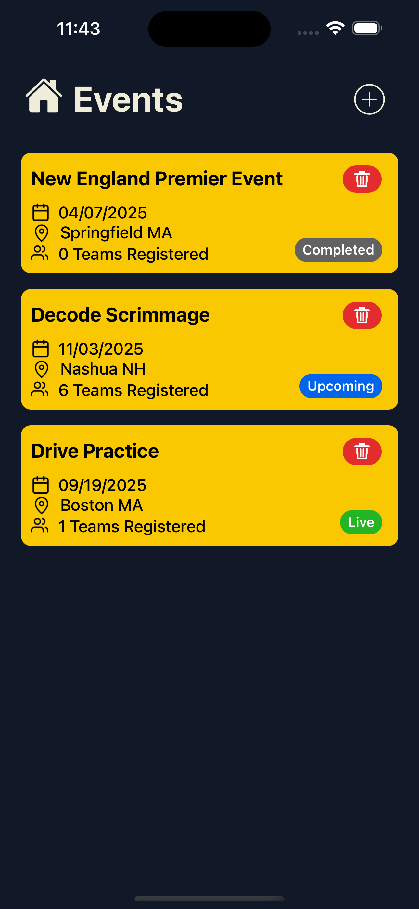
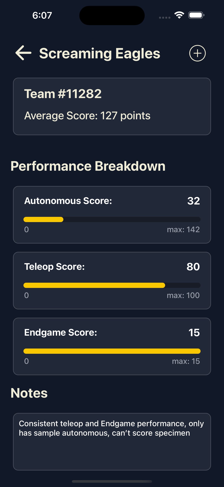

# FTCNotes

<h2>The best scouting and notetaking app for FTC </h2>

## Technologies

## Showcase

  
  &nbsp;&nbsp;&nbsp;&nbsp;&nbsp;
  
  &nbsp;&nbsp;&nbsp;&nbsp;&nbsp;
  

## Features
- Secure google signin
- Automatic team ranking based on cummulative avg points
- Ability to manage organizations for both owners/admins and members
